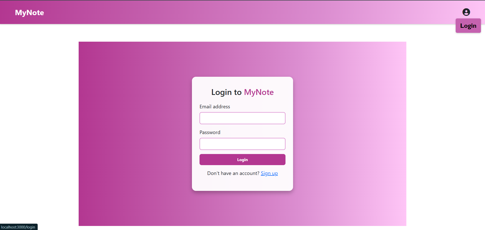
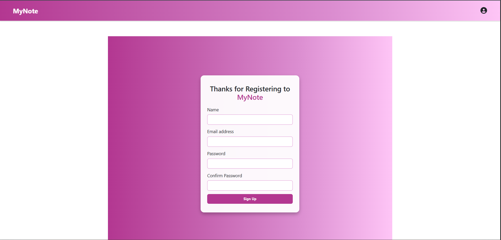
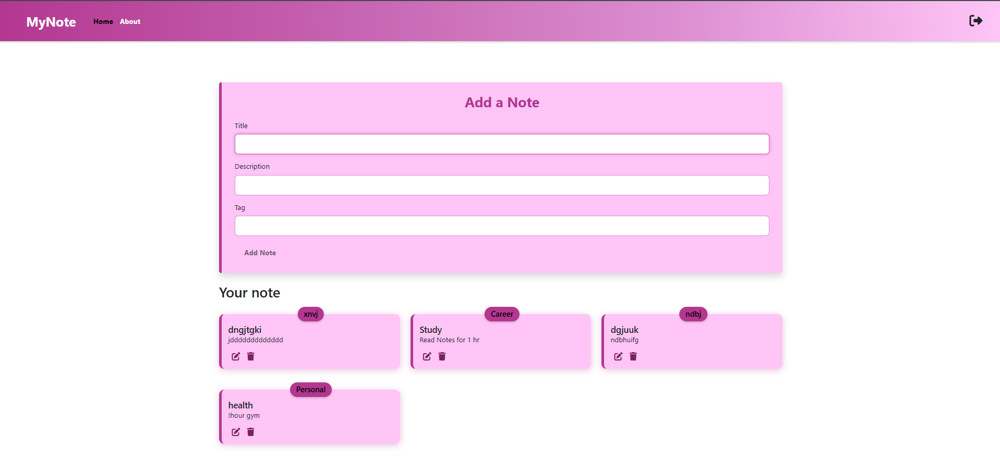
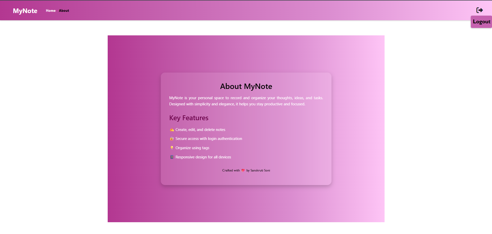
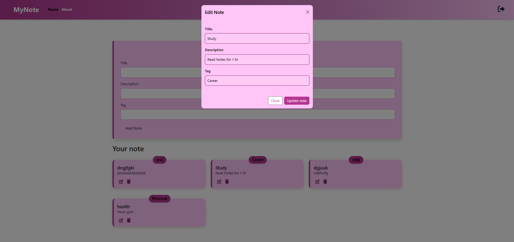

📝 myNotes

myNotes is a modern, user-friendly note-taking web application built with the MERN stack. It allows users to securely register, log in, and manage personal notes — all through a clean and responsive interface.

✨ Features:
   - User Authentication: Secure registration, login, and logout using JWT.
   - Notes Management: Add, view, update, and delete personal notes.
   - Modern UI: Clean and intuitive interface built with React.js.
   - Protected Routes: Only logged-in users can manage notes.
   - Secure Backend: Express.js with MongoDB & Mongoose.

📸 Preview

 
 
 
 
 

🛠️ Tech Stack

| Technology     | Description                            |
|----------------|----------------------------------------|
| ⚛️ React.js     | Frontend framework                     |
| 🚀 Express.js   | Backend server framework               |
| 🍃 MongoDB      | NoSQL database                         |
| 🧩 Mongoose     | MongoDB ODM for schema modeling        |
| 🔐 JWT          | Token-based authentication             |
| 🔑 bcrypt       | Secure password hashing                |

⚙️ Getting Started

📦 Prerequisites
   - ✅ [Node.js](https://nodejs.org/) and npm installed
   - ✅ [MongoDB](https://www.mongodb.com/) installed & running locally

📁 Installation

1. Clone the repository:
   - git clone https://github.com/san-soni30/myNotes.git
   - cd mynotes

2. Install dependencies:
   - npm install        # for frontend
   - cd backend
   - npm install        # for backend
   - cd ..
   - Start MongoDB (if not already running):
   - mongod

3. Run both frontend and backend:
   - npm run both

4. Open your browser:
   - Frontend: http://localhost:3000
   - Backend: http://localhost:5000

🚀 Usage

| Action             | Description                           |
| ---------------    | ------------------------------------- |
| 📝 Register        | Create a new user account             |
| 🔐 Login           | Securely sign in to your account      |
| ➕ Add Note        | Click “Add Note” to create a new note |
| ✏️ Edit Note       | Use the edit icon on any note         |
| 🗑️ Delete Note     | Use the delete icon on any note       |
| 🚪 Logout          | Click the logout icon in the navbar   |

📂 Project Structure

mynotes/
├── backend/              # Express.js backend
│   ├── routes/           # API endpoints (auth, notes)
│   ├── models/           # Mongoose schemas
│   ├── middleware/       # JWT auth middleware
│   └── server.js         # Backend entry point
├── src/
│     ├── components/   # Reusable components
│     ├── pages/        # Login, Signup, Notes
│     └── context/      # Auth & notes context
├── public/               # Static frontend files
└── README.md

🔐 Security Highlights
   - Passwords are hashed using bcrypt before storing in MongoDB.
   - JWT tokens protect routes and validate each user session.
   - Notes and data are only accessible to authenticated users.

🧪 Future Enhancements
   - Dark Mode toggle
   - Tag-based filtering and categorization
   - Rich-text editing support
   - Deployment to Vercel / Render

📄 License
   - This project is for educational purposes and can be modified or extended as needed.

🙌 Crafted with 💖 by Sanskruti Soni